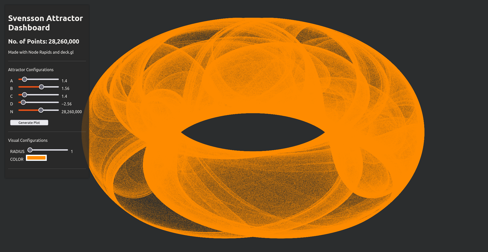
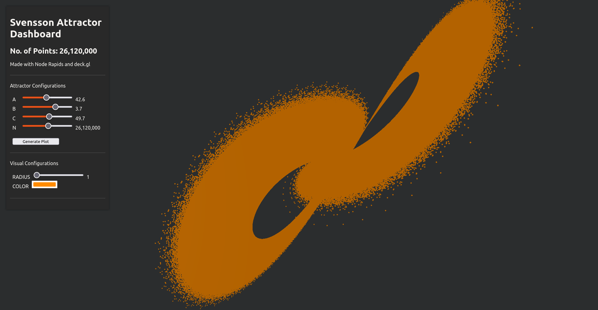

# Attractor panel Viz using node-rapids

This is a [Next.js](https://nextjs.org/) project bootstrapped with [`create-next-app`](https://github.com/vercel/next.js/tree/canary/packages/create-next-app).

## Installation

```bash
yarn
```

The above should install all the dependencies, including node-rapids!

## Getting Started

First, run the development server:

```bash
npm run dev
# or
yarn dev
```

1. Svensson Attractor (pre-generated dataset)

Generate the dataset using python scripts provided in the `python/dataset_gen.py`.

Go to `http://localhost:3000/svensson` :



2. Lorenz Attractor (realtime generation)

Go to `http://localhost:3000/lorenz` :



## Learn More

To learn more about Next.js, take a look at the following resources:

- [Next.js Documentation](https://nextjs.org/docs) - learn about Next.js features and API.
- [Node Rapids](https://github.com/rapidsai/node) - node-rapids is a collection of Node.js native addons for the NVIDIA RAPIDS suite of GPU-accelerated data-science and ETL libraries on Linux and WSL2.

> inspired by <https://attractors.pyviz.demo.anaconda.com/attractors_panel>
